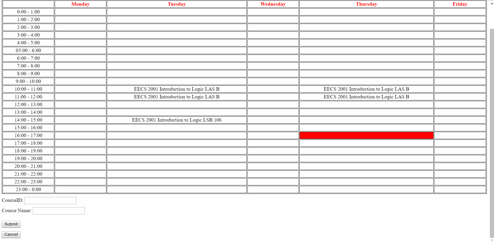
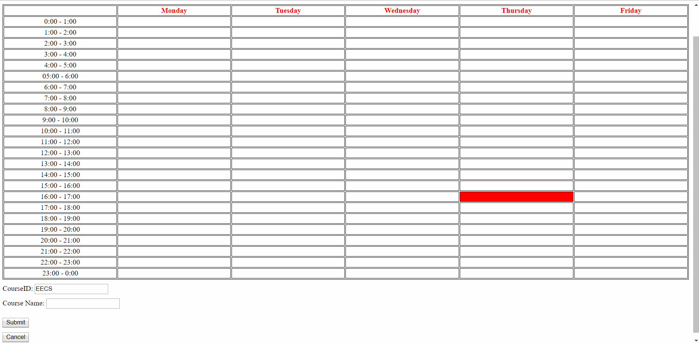
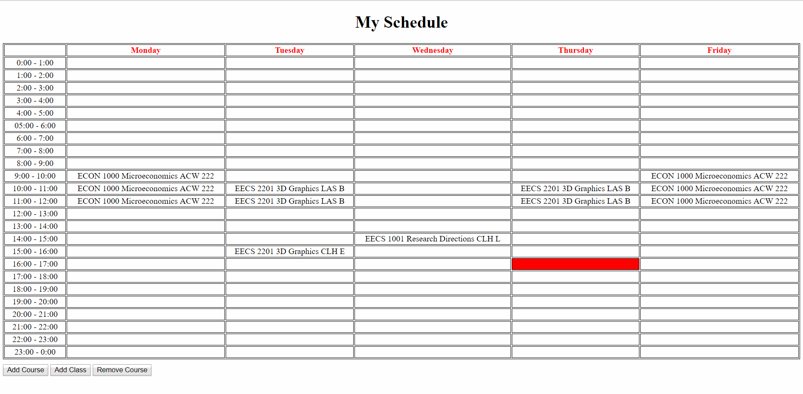
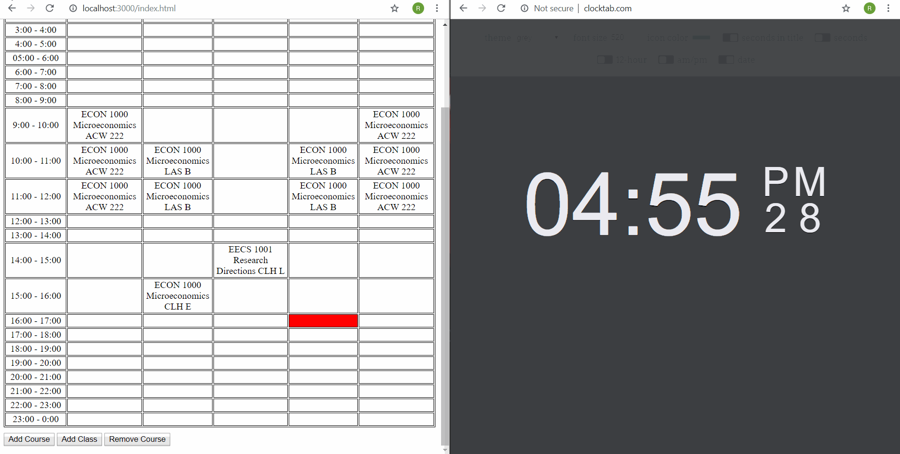

# Student-Schedule
This application displays a weekly schedule with hourly timeslots from Monday to Friday. Students can enter what they courses they have and when they have them and the table will update and display the information. In addition, the current timeslot is highlighted in red.

## Adding Courses/Classes
This is a demo GIF showing how to add a course and a class for it. It also shows how to add more than once class for a course and also what happens when you try to add a course that already exists.   

## Adding more than one class on a single day
This is a demo GIF showing how to add multiple classes for a course on a single day.   

## Removing a course
This is a demo GIF that shows what happens when a course is removed from the schedule. Notice that all classes for the course are no longer displayed on the schedule. (At the beginning I was showing that the cancel button works).   

## Timeslot Highlighting
This is a demo GIF that shows how the schedule highlights the current timeslot, but most importantly it shows what happens when the hour changes. Notice that I refresh at the XYZ second but the highlight changes exactly at 17:00:00. (This GIF was recorded at 1 FPS which is why it looks so slow towards the end).   

### Story of this project
When I was in my first year at York University for Computer Science, we were first learning HTML, CSS, and JS and this was one of the assignments we had to do. The assignment was also meant to serve for our own use once we completed it.  

The problem was we had to hard-code the data into the HTML table, which was a real pain. So after graduating, I decided to revisit this assignment and eliminate the need to hard-code by attaching a sqlite database and serving it a Node backend.  

This application would still not be very useful for students for several reasons, but it is nice to know that I have fixed the problem that first year me was complaining about.
